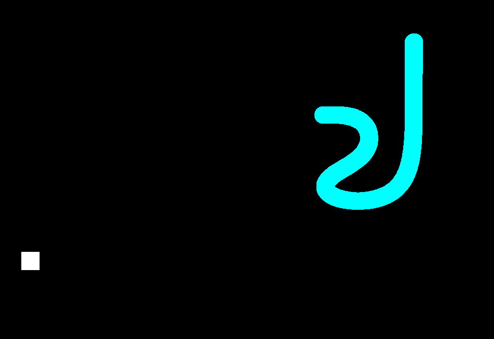
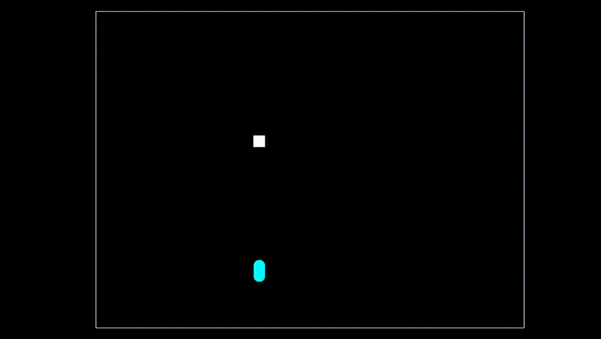

# Snake
So I decided to make my 4-year-old game not suck

 
# Setting Up Camp:
  ## By Hand:
  
  `gcc ssw.c bezier.c snake.c -o snake -lX11`

# What's inside
  ## Controls:
    ### Arrow pad only (no wasd, sorry)
    ### Spacebar to pause
  ## Misc:
    ### Snake speed increases by ~3 hundredths of a second for every pellet eaten
    ### After a certain thresh-hold the snake stops going faster, and slows down
  ## Technical:
    ### drawcurve() for snake curvature (bezier polynomial) (updated to take Pixmap buffer for main window)
    ### I included FISR four years ago; could've removed, but didn't 
    ### ssw.h has all but become obsolete. I needed more granular control over X11 for *cough cough* optimizations
    ### A nasty result of the former is the Exposure() routine, which seeks to blend the "operability" of X11 and ssw, even though one is a superset of the other.
    ### This project is the stepping stool for further improvements to ssw, given my now more proficient understanding of X11. 
    ### snake is drawn from bitmask, instead of the repeated drawing of circles directly to the window (this looked *really* bad).
    ### Timing mechanism was previously usleep() and then was clock(). Apparently frame syncing is best done without either of those options.
    ### I don't see how I'm porting this to my SDL build for Windows, so I guess I'll stop here.

# Other
  ## [Original repository](https://github.com/xleph/snake) 

